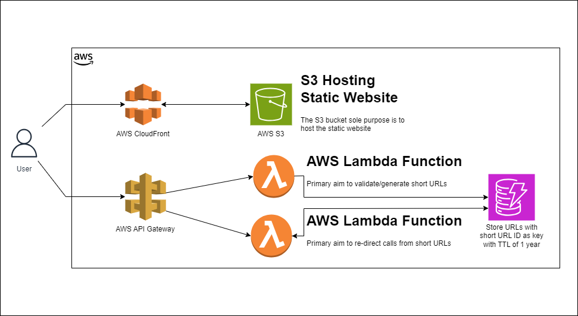

# Go Short

## Introduction
[Go Short](https://shrt.bitsar.net) is a tool that converts long URLs into abbreviated versions, resulting in a shorter link that is easier to share and manage. These shortened URLs typically redirect to the original, long URL. They are particularly useful in several scenarios:

1. Ease of Sharing: Shortened URLs are easier to share, especially in environments with character limits like Twitter or in printed materials where space is at a premium.

2. Improved Aesthetics: Short links look cleaner and are more user-friendly, making them more appealing for users to click on.

3. Tracking and Analytics: URL shorteners often come with built-in analytics. This means you can track the performance of the link, like the number of clicks, geographic location of users, and other metrics, which is valuable for marketing and analysis.

4. Management of Links: They allow for better management of URLs, especially when dealing with complex or lengthy links that contain long query parameters.

5. Prevent URL Manipulation: By shortening a URL, you can also prevent users from easily manipulating the parameters of the URL, which can be important for security reasons.

In essence, URL shorteners are not only about making a link shorter; they also add a layer of functionality and usability that can be crucial for digital marketing, analytics, and user experience.

## Architecture

## Technologies Used

- Python3
- React Native
- AWS API Gateway
- AWS CloudFront
- AWS S3 Bucket
- AWS Lambda Function
- AWS DynamoDB
